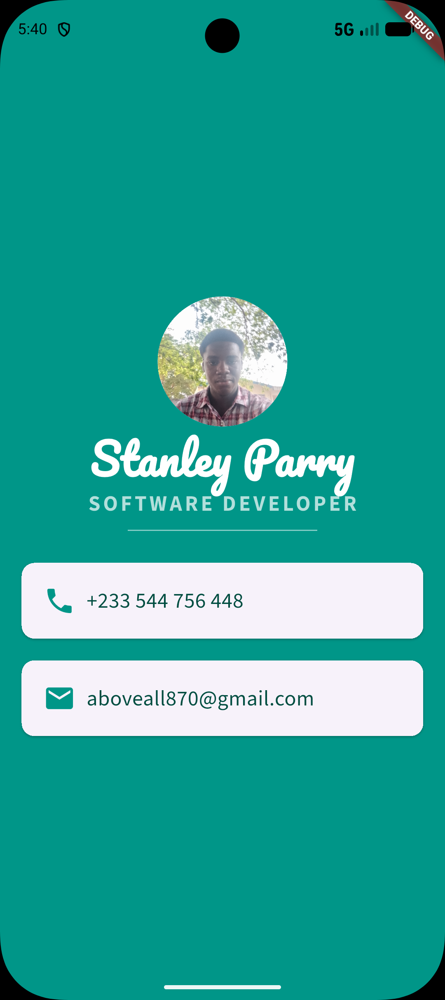

# Business Card App

A simple Flutter digital business card: profile photo, name, title, and
contact info (phone and email) laid out as cards.

## Screenshots

  

## Features

- Circular profile photo
- Name and job title styling with custom fonts (Pacifico, SourceSans3)
- Contact cards with icons for phone and email

## Getting Started

This is a standard Flutter project.

1. Install [Flutter](https://docs.flutter.dev/get-started/install)
2. Clone this repo and run:
   ```
   flutter pub get
   flutter run
   ```
